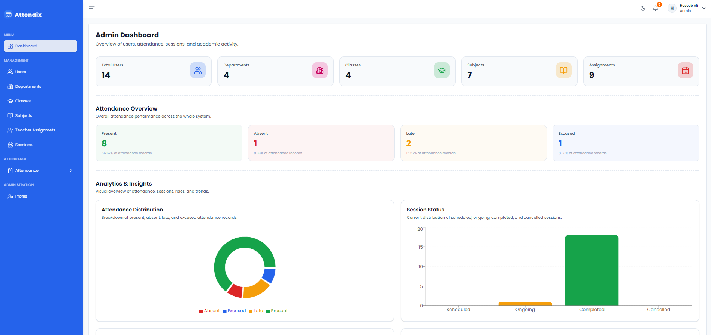
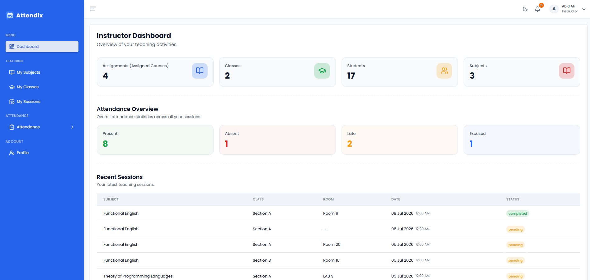
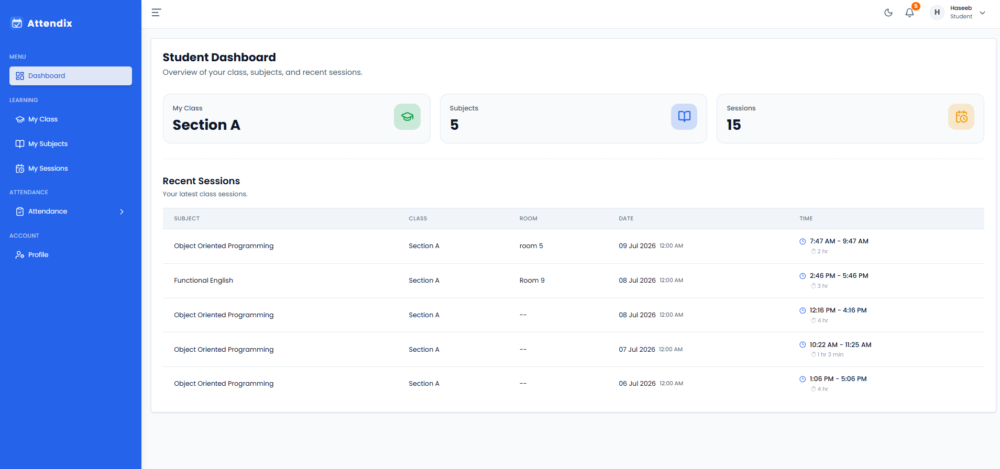
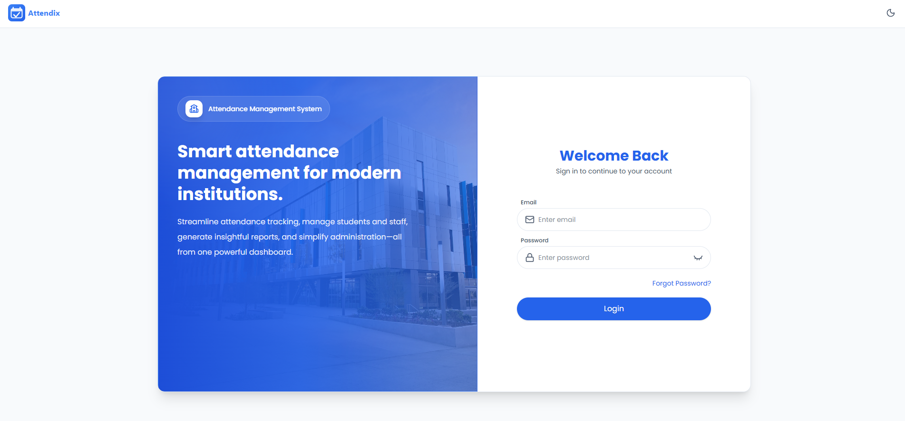

<div align="center">

# 📚 Attendix

### A modern, role-based Attendance Management System

*Built during the InnoViast Full-Stack Product Engineering Internship*


<br/>


</div>

---

## ✨ Overview

**Attendix** is a completed, production-ready attendance management platform for educational institutes, academies, bootcamps, and organizations — with dedicated experiences for **Admins**, **Instructors**, and **Students**.

Built with a **monorepo architecture** sharing types and validation logic across the full stack, Attendix delivers consistent contracts between frontend and backend, modular domain boundaries, and analytics-ready data at every layer — all wrapped in a polished, animated UI.

<table>
<tr>
<td width="33%" valign="top">

### 🛡️ Admin
Full system-wide visibility: departments, classes, subjects, teacher assignments, users, and live analytics.

</td>
<td width="33%" valign="top">

### 🎓 Instructor
Manages assigned classes and subjects, creates sessions, marks attendance, and reviews session history.

</td>
<td width="33%" valign="top">

### 🧑‍🎓 Student
A focused dashboard for personal attendance records and academic activity.

</td>
</tr>
</table>

---

## 🖼️ Screenshots

<div align="center">

<!-- Add your screenshots below. Recommended: PNG/WebP, 1200–1600px wide, stored in a `docs/screenshots/` folder in the repo. -->

### Admin Dashboard


### Instructor Dashboard


### Student Dashboard


### Login


</div>

---

## 🧩 Core Capabilities

| Domain | What it does |
|---|---|
| 🔐 **Auth & Access** | JWT-based authentication (access + refresh tokens), RBAC, protected routes, Argon2 password hashing, shared Zod validation |
| 👥 **User Management** | Admin / Instructor / Student management, filtering, status control, role-specific access |
| 🏫 **Academic Structure** | Departments, Classes, Subjects, and Instructor-to-Subject Assignments |
| 🗓️ **Attendance Engine** | Session lifecycle (scheduled → ongoing → completed / cancelled), attendance marking (Present / Absent / Late / Excused) with remarks |
| ⏱️ **Automation** | Upstash QStash-driven session status updates on a serverless schedule |
| 📊 **Dashboards** | Role-specific dashboards with charts, trends, and recent-activity feeds |
| 📈 **Analytics** | Aggregated attendance stats, chart-ready API responses, session insights |
| 🎨 **Motion & Polish** | Framer Motion fade-up/stagger animations across auth and dashboard flows, SEO metadata via react-helmet-async |

---

## 🖥️ Dashboards at a Glance

**Admin** — system-wide overview cards, attendance distribution charts, role distribution, monthly trends, recent users/sessions/assignments

**Instructor** — assigned classes & subjects, student/session counts, upcoming & recent sessions, class summaries

**Student** — personal attendance overview and academic activity, streamlined for quick access

---

## 🏗️ Architecture

Attendix uses a **PNPM-powered monorepo**, keeping frontend, backend, and shared logic in one coherent codebase.

```text
Attendix/
│
├── apps/
│   ├── api/                     → Express + TypeScript backend
│   └── web/                     → React + TypeScript frontend
│
├── packages/
│   ├── shared-types/            → Shared TypeScript contracts & status enums
│   └── shared-zod/              → Shared Zod validation schemas
│
└── docs/                        → Architecture notes & diagrams
```

**Why it matters:** one source of truth for types and validation means the frontend and backend can never silently drift apart — a bug class most full-stack apps never fully eliminate.

---

## 🛠️ Tech Stack

<table>
<tr>
<td valign="top" width="50%">

**Frontend**
- React + TypeScript + Vite
- Tailwind CSS v4 + shadcn/ui
- React Router DOM
- React Hook Form + Zod
- Axios data layer
- Recharts (analytics visualizations)
- Framer Motion (UI motion)
- react-helmet-async (SEO metadata)
- Lucide React (icons)

</td>
<td valign="top" width="50%">

**Backend**
- Node.js + Express + TypeScript
- MongoDB + Mongoose (serverless-cached connections)
- JWT (access + refresh token flow)
- Argon2 password hashing
- Zod (shared validation)
- Upstash QStash (per-minute scheduled session jobs)

</td>
</tr>
</table>

**Monorepo tooling:** PNPM Workspaces · Shared Types Package · Shared Zod Package

---

## 🗄️ Data Model

Attendix's schema follows a **Department → Class / Subject → TeacherAssignment → Session → Attendance** hierarchy, with every collection carrying a `status` field driven by shared enums (`@attendance/shared-types`) and Mongoose timestamps.

<details>
<summary><strong>Click to expand collection schemas</strong></summary>

```ts
// Department
{
  name: string;              // unique
  code: string;              // unique, uppercase
  description?: string;
  status: "active" | "inactive";
}

// Class
{
  name: string;               // unique per department
  code: string;                // unique per department, uppercase
  department: ObjectId;        // ref: Department
  description?: string;
  status: "active" | "inactive";
}

// Subject
{
  name: string;               // unique per department
  code: string;                // unique per department, uppercase
  department: ObjectId;        // ref: Department
  description?: string;
  status: "active" | "inactive";
}

// TeacherAssignment
{
  instructor: ObjectId;        // ref: User
  department: ObjectId;        // ref: Department
  class: ObjectId;             // ref: Class
  subject: ObjectId;           // ref: Subject
  status: "active" | "inactive";
  // unique per (instructor, class, subject)
}

// Session
{
  teacherAssignment: ObjectId; // ref: TeacherAssignment
  date: Date;
  startTime: string;
  endTime: string;
  room?: string;
  status: "scheduled" | "ongoing" | "completed" | "cancelled";
  // unique per (teacherAssignment, date, startTime)
}

// Attendance
{
  session: ObjectId;           // ref: Session
  student: ObjectId;           // ref: User
  status: "present" | "absent" | "late" | "excused";
  remarks?: string;
  markedAt: Date;
  // unique per (session, student)
}
```

**Integrity rules enforced at the schema level:**
- A department's name and code are globally unique.
- A class or subject's name/code is unique *within its department*.
- An instructor cannot be assigned to teach the same subject in the same class twice.
- A session can't be duplicated for the same teacher assignment, date, and start time.
- A student can only have one attendance record per session.

</details>

---

## 🔑 Demo Accounts

Use these seeded credentials to explore each role. If your database doesn't have them yet, seed your own test users with these emails/passwords (or swap in your real seed script output).

| Role | Email | Password |
|---|---|---|
| 🛡️ Admin | `admin@attendix.dev` | `Admin@123` |
| 🎓 Instructor | `instructor@attendix.dev` | `Instructor@123` |
| 🧑‍🎓 Student | `student@attendix.dev` | `Student@123` |

> 📌 **How to add your own:** replace the table above with your actual seeded accounts (or a link to your seed script, e.g. `apps/api/src/scripts/seed.ts`). Never put real/production credentials here — only demo data meant for reviewers to try the live app.

---

## ⚙️ Getting Started

**1. Clone the repository**
```bash
git clone <repository-url>
cd Attendix
```

**2. Install dependencies**
```bash
pnpm install
```

**3. Run the backend**
```bash
cd apps/api
pnpm dev
```

**4. Run the frontend**
```bash
cd apps/web
pnpm dev
```

---

## 🔐 Environment Variables

Create a `.env` file inside `apps/api` with the following keys:

```env
# Server
PORT=5000
NODE_ENV=development

# Database
MONGODB_URI=your_mongodb_connection_string

# Client
CLIENT_URL=http://localhost:5173

# Auth — Access Token
JWT_ACCESS_SECRET=your_access_token_secret
JWT_ACCESS_EXPIRES_IN=15m

# Auth — Refresh Token
JWT_REFRESH_SECRET=your_refresh_token_secret
JWT_REFRESH_EXPIRES_IN=7d

# Cookie Expiry (ms)
ACCESS_COOKIE_MAX_AGE=900000    # 15 minutes
REFRESH_COOKIE_MAX_AGE=604800000 # 7 days

# Scheduled Jobs
CRON_SECRET=your_cron_job_secret
```

And inside `apps/web`:

```env
VITE_API_BASE_URL=http://localhost:5000/api/v1
```

> ⚠️ Never commit real `.env` values. Use `.env.example` files with placeholder keys only — exactly as shown above.

---

## ✅ Project Status

Attendix is **feature-complete** and deployed. All core modules — auth, academic structure, session lifecycle, attendance marking, dashboards, and analytics — are implemented and running in production.

| Area | Status |
|---|---|
| Monorepo & shared package architecture | ✅ Done |
| JWT auth flow with RBAC | ✅ Done |
| Departments, Classes, Subjects, Assignments | ✅ Done |
| Session lifecycle & automated status updates (QStash) | ✅ Done |
| Attendance marking & remarks | ✅ Done |
| Admin, Instructor, and Student dashboards | ✅ Done |
| Attendance analytics aggregation | ✅ Done |
| UI polish: Framer Motion, SEO metadata, branded assets | ✅ Done |

**Possible future enhancements:** CSV/Excel export, email notifications, dark mode — not required for the current release.

---

## 🚀 Deployment

| Layer | Platform |
|---|---|
| Frontend | Vercel |
| Backend | Vercel (serverless functions) |
| Database | MongoDB Atlas |
| Scheduled Jobs | Upstash QStash |

---

## 👨‍💻 Author

**Haseeb Ali**
Full-Stack Developer Intern @ InnoViast

Focused on scalable architecture, reusable shared packages, and production-style code organization in modern dashboard-driven applications.

<p align="left">
<a href="https://github.com/haseeb9678" target="_blank"></a>
<a href="https://linkedin.com/in/haseeb963" target="_blank"></a>
</p>

---

<div align="center">

*Attendix is complete and actively maintained — this README reflects the final, deployed architecture and modules.*

</div>